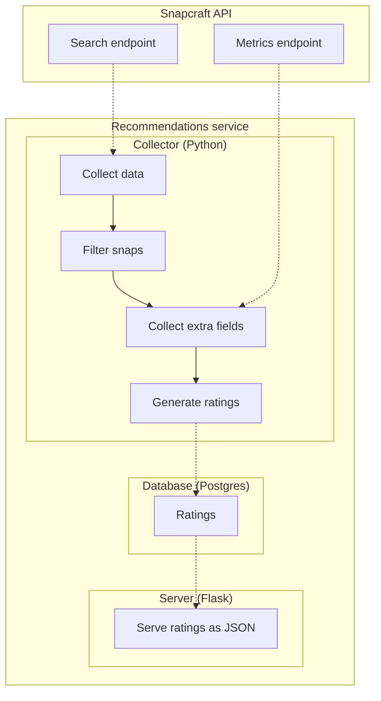

# Snap Recommendation Service
This service is responsible for generating and serving recommendations for snaps.

## Development

### Prerequisites
- Python 3.8

### Collector

You can use `docker compose up -d` to start the service alongside a postgres DB. But first you'll need to follow the instructions in collector/README.md to populate the `FLASK_SNAPSTORE_MACAROON_KEY` env variable.

If running for the first time, you must run the following to apply migrations:

```
docker compose exec web flask db upgrade
```

#### Manual Setup

```bash
# create a virtual environment
python3 -m venv venv
source venv/bin/activate
pip install -r requirements.txt
```

#### Running the collector
```bash
flask collector start
```

### Server

```bash
flask run
```


## Architecture
The Snap Recommendation Service consists of two main components:
1. Collector (Python): A pipeline for collects data from multiple sources and processes it to generate recommendations. This is a job that runs weekly
2. Server (Flask): Serves rankings as JSON to be consumed by other services such as snapcraft.io.

Both components use a shared database (SQLite) to store both snap data and rankings (see `models.py` for the schemas)

### Collector
The collector is a multi-stage pipeline, each stage can be run independently if needed by running the corresponding script. The stages are:
1. `collect.py`: Collecting data from the snap store [for all public (searchable) snaps]. 
2. `filter.py`: Filter out snaps that are not suitable for recommendations (e.g snaps that don't have an icon, etc)
3. `extrafields.py` Collect extra data from the snap store (e.g. active devices), this is done after filtering to reduce the number of requests
4. `score.py`: Generate ratings for each snap based on multiple categories (e.g. popularity, trendiness, etc)

The entire pipeline can be run by running `flask collector start` which will run all the stages in order. See `flask collector --help` if you'd like to run a stage individually.

### Server
The server is a very lightweight Flask server that serves the rankings for a given category.

### DB & Migrations

Any modifications to the models inside `snaprecommend/models.py` should result in a new migration that will be applied to the DB on the next deployment. To create a new migration:

```
flask db migrate -m "Added icon column"
```

Then apply the migration with `flask db upgrade`.

Any of the commands above can be prefixed with `docker exec web` if running using docker compose

## Flowchart

Some change for demo don't merge
