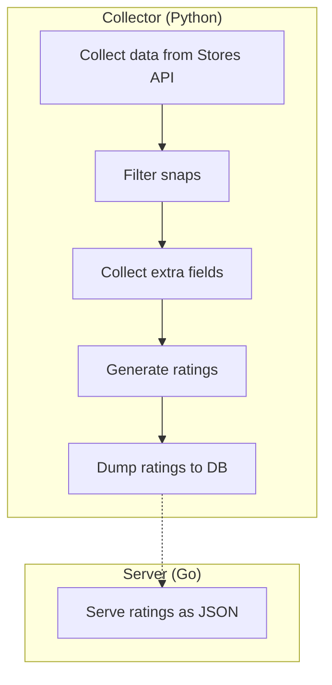

# Snap Recommendation Service
This service is responsible for generating and serving recommendations for snaps.

## Development

### Prerequisites
- Python 3.8
- Go ~1.22.2

### Collector

#### Setup
```bash
cd collector
# create a virtual environment
python3 -m venv venv
source venv/bin/activate
pip install -r requirements.txt
```

#### Running the collector
```bash
python main.py
```

### Server

```bash
cd server
go run .
```


## Architecture
The Snap Recommendation Service consists of two main components:
1. Collector (Python): A pipeline for collects data from multiple sources and processes it to generate recommendations.
2. Server (Go): Serves rankings as JSON to be consumed by other services such as snapcraft.io.

Both components use a shared database (SQLite) to store both snap data and rankings (see `models.py` for the schemas)

### Collector
The collector is a multi-stage pipeline, each stage can be run independently if needed by running the corresponding script. The stages are:
1. `collect.py`: Collecting data from the snap store [for all public (searchable) snaps]
2. `filter.py`: Filter out snaps that are not suitable for recommendations (e.g snaps that don't have an icon, etc)
3. `more_fields.py` Collect extra data from the snap store (e.g. active devices), this is done after filtering to reduce the number of requests
4. `rank.py`: Generate ratings for each snap based on multiple categories (e.g. popularity, trendiness, etc)

The entire pipeline can be run by running `main.py` which will run all the stages in order.

### Server
The Go server is a very lightweight HTTP server that serves the rankings for a given category.

## Flowchart

